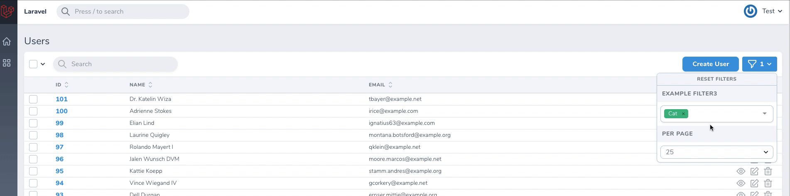

# Nova Multiselect Filter

[](https://packagist.org/packages/outl1ne/nova-multiselect-filter)
[](https://packagist.org/packages/outl1ne/nova-multiselect-filter)

This [Laravel Nova](https://nova.laravel.com) package adds a multiselect to Nova's filters.

## Requirements

- `php: >=7.2`
- `laravel/nova: ^4.0`

## Features

- Multi select
- Single select
- Group select
- Search

## Screenshots

### Multiselect


### Groupselect



## Installation

Install the package in a Laravel Nova project via Composer:

```bash
composer require outl1ne/nova-multiselect-filter
```

## Usage

The filter can be used when switching `Filter` class with `MultiselectFilter`.

```php
use Outl1ne\NovaMultiselectFilter\MultiselectFilter;

class BooksByAuthorFilter extends MultiselectFilter
{
    public function apply(Request $request, $query, $value)
    {
        return $query->whereHas('books', function ($query) use ($value) {
            $query->whereIn('author_id', $value);
        });
    }

    public function options(Request $request)
    {
        return Authors::all()->pluck('name', 'id');
    }
}

```

### Option groups

Option groups are supported. Their syntax is the same as [Laravel's option group syntax](https://nova.laravel.com/docs/2.0/resources/fields.html#select-field).

In this example (from Nova docs), all values are grouped by the `group` key:

```php
    public function options(Request $request)
    {
        return [
          'cat' => ['label' => 'Cat', 'group' => 'Pets'],
          'dog' => ['label' => 'Dog', 'group' => 'Pets'],
          'eagle' => ['label' => 'Eagle', 'group' => 'Birds'],
          'parrot' => ['label' => 'Parrot', 'group' => 'Birds'],
        ]
    }
```

## Options

Possible options you can pass to the filter using the option name as a function, ie `->placeholder('Choose peanuts')`.

| Option         | type            | default    | description                                                                                            |
| -------------- | --------------- | ---------- | ------------------------------------------------------------------------------------------------------ |
| `options`      | Array\|callable | []         | Options in an array as key-value pairs (`['id' => 'value']`).                                          |
| `placeholder`  | String          | Field name | The placeholder string for the input.                                                                  |
| `max`          | Number          | Infinite   | The maximum number of options a user can select.                                                       |
| `groupSelect`  | Boolean         | false      | For use with option groups - allows the user to select whole groups at once                            |
| `singleSelect` | Boolean         | false      | Makes the field act as a single select. The returned value will be an array with one element.          |
| `optionsLimit` | Number          | 1000       | The maximum number of options displayed at once. Other options are still accessible through searching. |

## Localization

The translations file can be published by using the following publish command:

```bash
php artisan vendor:publish --provider="Outl1ne\NovaMultiselectFilter\FieldServiceProvider" --tag="translations"
```

You can then edit the strings to your liking.

## Credits

- [Kaspar Rosin](https://github.com/kasparrosin)
- [Tarvo Reinpalu](https://github.com/Tarpsvo)
- [shentao/vue-multiselect](https://github.com/shentao/vue-multiselect)
- [All Contributors](https://github.com/outl1ne/nova-multiselect-filter/graphs/contributors)

This package was inspired by [klepak/nova-multiselect-filter](https://github.com/klepak/nova-multiselect-filter)

## License

This project is open-sourced software licensed under the [MIT license](LICENSE.md).
